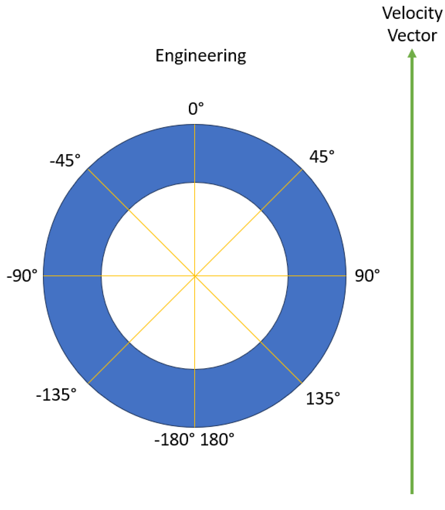
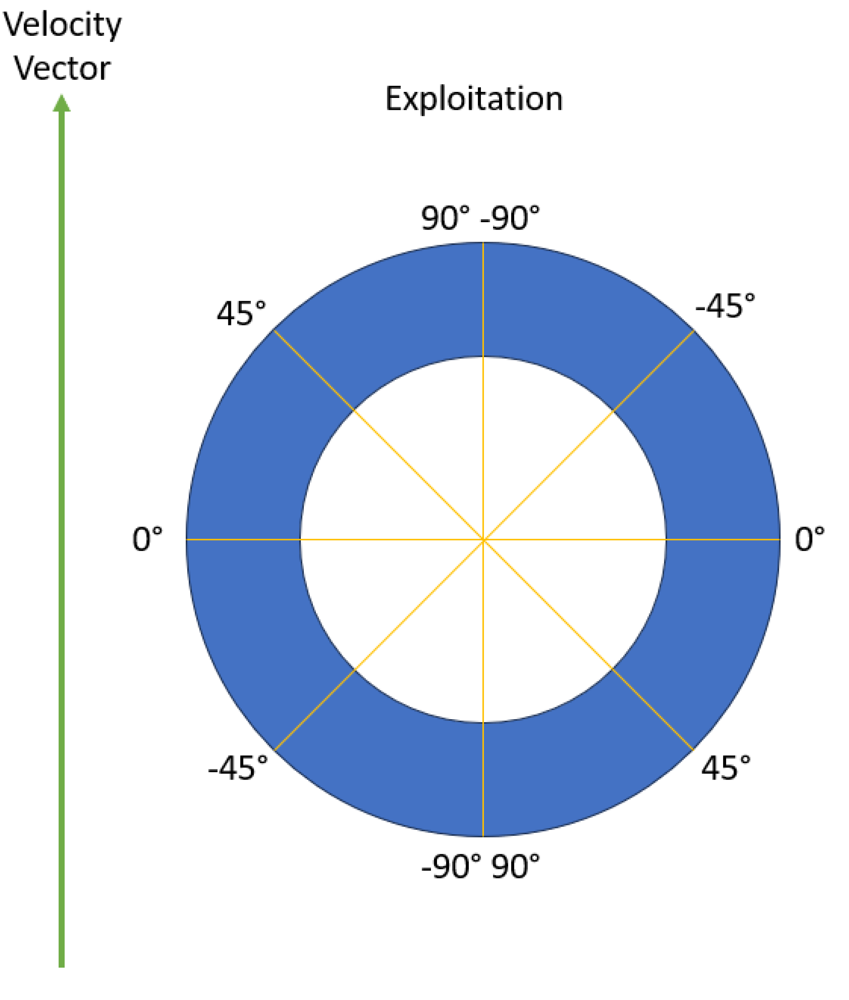
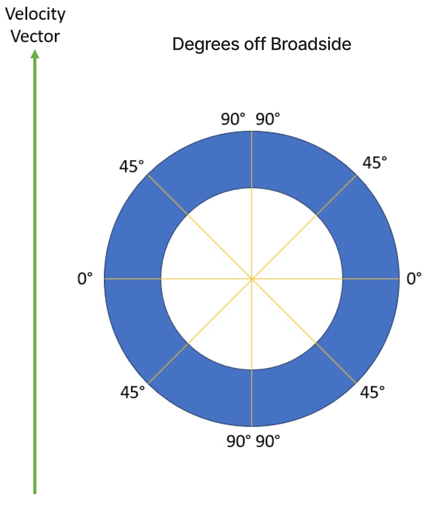
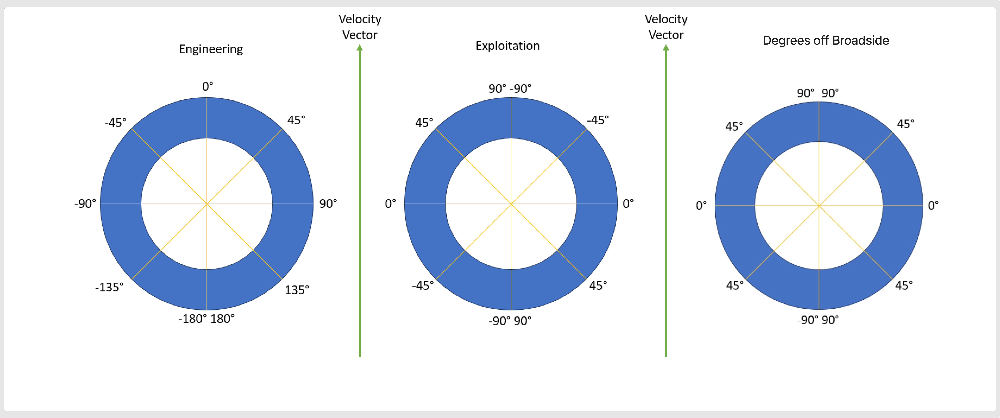

# Umbra Extension Specification

- **Title:** Umbra
- **Identifier:** <https://stac-extensions.github.io/umbra/v1.0.0/schema.json>
- **Field Name Prefix:** umbra
- **Scope:** Item, Collection
- **Extension [Maturity Classification](https://github.com/radiantearth/stac-spec/tree/master/extensions/README.md#extension-maturity):** Proposal
- **Owner**: @davidraleigh-umbra @pcaisse-umbra

This document explains the Umbra Extension to the [SpatioTemporal Asset Catalog](https://github.com/radiantearth/stac-spec) (STAC) specification. \
This document describes fields of metadata for users of the [Umbra Space](https://umbra.space) task and collect metadata.

In addition to this umbra STAC extension, Umbra STAC metadata includes the [`sat` extension](https://github.com/stac-extensions/sat), the \
[`sar` extension](https://github.com/stac-extensions/sar), the [`view` extension](https://github.com/stac-extensions/view) and the [`processing` extension](https://github.com/stac-extensions/processing).

- Examples:
  - [Item example](examples/item.json): Shows the basic usage of the extension in a STAC Item
- [JSON Schema](json-schema/schema.json)
- [Changelog](./CHANGELOG.md)

## Fields

The fields in the table below can be used in these parts of STAC documents:

- [ ] Catalogs
- [ ] Collections
- [x] Item Properties (incl. Summaries in Collections)
- [ ] Assets (for both Collections and Items, incl. Item Asset Definitions in Collections)
- [ ] Links

| Field Name                               | Type   | Description                                                                                                                                                                                                                                                                                                                                                                                                                                                                                                                     |
|------------------------------------------|--------|---------------------------------------------------------------------------------------------------------------------------------------------------------------------------------------------------------------------------------------------------------------------------------------------------------------------------------------------------------------------------------------------------------------------------------------------------------------------------------------------------------------------------------|
| umbra:task_id                            | UUID   | **REQUIRED**. task id. [Umbra Task docs](https://docs.canopy.umbra.space/docs/tasking#tasks)                                                                                                                                                                                                                                                                                                                                                                                                                                    |
| umbra:collect_id                         | UUID   | If the task is composed of a single collect there will be one collect id. [Umbra Collect docs](https://docs.canopy.umbra.space/docs/tasking#collects)                                                                                                                                                                                                                                                                                                                                                                           |
| umbra:collect_ids                        | [UUID] | collect ids for tasks which require multiple collects to accomplish task. [Umbra Collect docs](https://docs.canopy.umbra.space/docs/tasking#collects)                                                                                                                                                                                                                                                                                                                                                                           |
| umbra:grazing_angle_degrees              | number | The angle between the local vertical and the line of sight. It is a complement to the incidence angle (they always add up to 90&deg;). It determines how steep (or shallow) the angle of collection is. As a general rule, a higher grazing angle provides more image contrast but reduces the amount of access to the AOI.                                                                                                                                                                                                     |
| umbra:organization_id                    | string | organization that tasked the collect. ORG ID in [Canopy organization overview](https://canopy.umbra.space/organization)                                                                                                                                                                                                                                                                                                                                                                                                         |
| umbra:slant_range_meters                 | number | The Slant Range is the straight line distance between the target location and the satellite in meters.                                                                                                                                                                                                                                                                                                                                                                                                                          |
| umbra:squint_angle_engineering_degrees   | number | 0&deg; signifies the satellite's velocity vector - a reference point for orientation determination. Negative is to the left of vehicle and positive to the right. 180&deg;/-180&deg; is the opposite direction of the velocity vector.                                                                                                                                                                                                                                             |
| umbra:squint_angle_exploitation_degrees  | number | On the right side of vehicle, -90&deg; is velocity vector direction, 0&deg; broadside and 90&deg; opposite of velocity vector. on Left side 90&deg; is velocity vector direction, 0&deg; broadside and -90&deg; opposite to velocity vector. To be used in conjunction with [sar extension](https://github.com/stac-extensions/sar/tree/v1.0.0?tab=readme-ov-file#item-properties) `sar:observation_direction` to determine `"left"` and `"right"` antenna pointing direction.   |
| umbra:squint_angle_degrees_off_broadside | number | 90&deg; is in the direction of the velocity vector for both left and right observation directions. 90&deg; is also in the direction opposite of the velocity vector. 0&deg; is off broadside for both left and right observation directions.                                                                                                                                                                                                            |
| umbra:target_azimuth_angle_degrees       | number | The angle between the projected vector [the collection geometry of the particular opportunity] and a reference vector [north] on the reference plane is called the azimuth. This identifies the direction from which the capture will occur. As an example, a target azimuth angle of 90 degrees means the satellite will be due looking due west at the target from a position due east of the target.                                                                                                                         |

### Additional Field Information

Diagram demonstrating difference between `umbra:squint_angle_engineering_degrees`, `umbra:squint_angle_exploitation_degrees`, and `umbra:squint_angle_degrees_off_broadside`:


More details on squint [here](https://docs.canopy.umbra.space/docs/squint):

### Deprecated field

| Field Name                 | Type   | Description                                        |
|----------------------------|--------|----------------------------------------------------|
| umbra:squint_angle_degrees | number | replaced by umbra:squint_angle_engineering_degrees |

### Running tests

The same checks that run as checks on PR's are part of the repository and can be run locally to verify that changes are valid. 
To run tests locally, you'll need `npm`, which is a standard part of any [node.js installation](https://nodejs.org/en/download/).

First you'll need to install everything with npm once. Just navigate to the root of this repository and on 
your command line run:
```bash
npm install
```

Then to check markdown formatting and test the examples against the JSON schema, you can run:
```bash
npm test
```

This will spit out the same texts that you see online, and you can then go and fix your markdown or examples.

If the tests reveal formatting problems with the examples, you can fix them with:
```bash
npm run format-examples
```
